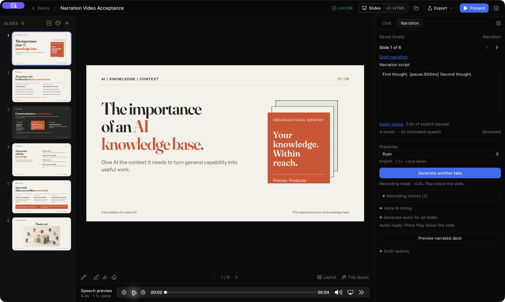

# Narration controls and skill — 10 October 2026

Implemented on `codex/narration-poc`. This follow-up gives agents verified narration guidance and makes explicit pauses reliable with the existing Qwen 0.6B CustomVoice provider. Personal presenters and tonal controls remain future work.

## Try it

Restart `pnpm app:dev`, open a deck and select **Narration** in the right sidebar. Place the cursor between two thoughts and click **Insert pause**. It inserts `[pause:800ms]`; edit the number to change the duration, then generate and play a take. The existing history picker retains older takes.

```text
First thought. [pause:800ms] Second thought.
```

This PoC uses readable inline markers rather than adding a rich text editor. Invalid markers show an inline error and block generation, while the editor keeps the draft for correction. Spoken word counts exclude valid pause markers; duration estimates include inserted silence.

## Connector and agent boundary

- The reusable `speech-connector` crate exposes `Descriptor.narrationControls`, `narrationGuidance` and `narration::render`. Both SlopSlide and the connector CLI use the renderer. It synthesizes clean passages, validates and normalizes their artifacts, then joins them with PCM silence after pace processing. Plain narration takes the unchanged synthesis path.
- `[pause:Nms]` accepts integer milliseconds from 1 to 60000, at most 100 markers and ten minutes of total explicit silence. The final recording including speech is also limited to ten minutes. Leading, trailing and adjacent pauses work. Model-generated natural pauses remain in addition to the inserted silence; no automatic join gap is added at the marker.
- Unsupported alphabetic bracket instructions, malformed markers and SSML/XML-style tags are rejected before model inference. Numeric bracket citations remain literal text. Tone, emotion, emphasis, pronunciation tags and inline voice/speed changes are unavailable. Qwen 0.6B instruction-driven tone is unsupported; a future model/provider needs its own tested capabilities.
- The [bundled narration skill](../../src-tauri/skills/slopslide-narration/SKILL.md) is supplied by `read_narration` with the selected providers' guidance. The original manifest/fingerprint response remains the first content block. Guidance is separate metadata, never stored in `narration.json`. No global skill installation is needed.
- `write_narration` validates changed scripts while preserving untouched drafts, other settings and take references. Unknown providers receive no marker guidance. This still uses the existing narration MCP tools; a standalone speech MCP server is not implemented by this follow-up.
- Marked recordings carry `narrationFormatVersion: 1` in source/cache identity, preventing reuse of old recordings that might have spoken a marker literally. Plain-script cache keys remain compatible and old takes remain readable.

The shared skill governs natural narration, fingerprint-safe writes and capability checks. Qwen-specific limits live with the Qwen connector, so another application can reuse rendering and guidance without Tauri or the skill.

## Verification and retained evidence

`./check.sh` passed: 888 frontend tests and 342 Rust tests, with five existing ignored Rust tests. This includes shared parser cases, exact silence at different speaking paces, unchanged plain PCM, rejection before provider invocation, cancellation, recording limits, cache compatibility, MCP writes and editor insertion/correction. Skill validation passed. The system prompt changed only narration guidance; the canonical deck HTML/runtime structure and linter rules did not change.

Native macOS acceptance used the disposable **Narration Video Acceptance** deck and real Qwen Ryan at 1.1×. Cursor insertion, generation, playback and recording history worked. The resulting WAV is 4.358 seconds at 24 kHz mono. An 800 ms insertion produced an approximately 846 ms zero-sample interval including natural silence. The exact insertion itself is verified separately by the renderer tests.

The six-slide narrated preview prepared successfully at 58.4 seconds; another slide already had its own narration and four slides were silent. This check did not rerun MP4 export. The original first-slide script and recording were restored through the history picker, its WAV hash remained unchanged, and the other slide's accepted recording was preserved. The user's original deck was not edited.



- [Qwen sample with an explicit pause](narration-pauses.wav)
- [Sanitized smoke result and hashes](narration-pauses-smoke.json)

Listen to generated output before accepting it: splitting synthesis at a marker can change delivery around the boundary. Broader listening checks and a richer marker editor are outside this pragmatic PoC. The next planned product phase remains saved personal presenters; the existing plan tracks it separately.
