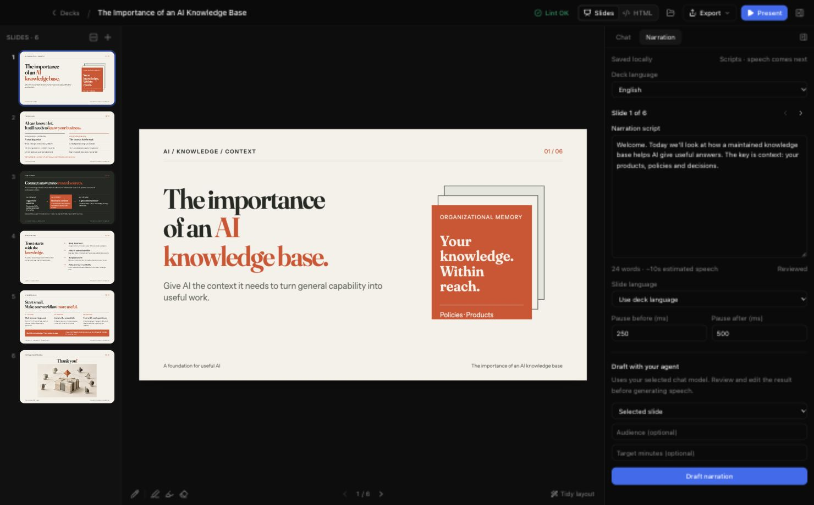

# Phase 1 — narration source

Implemented 9 October 2026 on `codex/narration-poc`. No PR or push.

## Try it

Run the desktop app with `pnpm app:dev`, open a deck, and choose **Narration** in the right sidebar. Write a script, switch slides/tabs, and reopen the deck. Scripts save automatically beside `deck.html` in `narration.json`. Choose the deck language, optionally override a slide, set lead-in/tail pauses, or give an empty slide a silent duration.

For Codex, leave **Codex permissions → Ask for approval** selected. Drafting opens Chat, where you can approve `read_narration` and `write_narration` when requested. This branch includes upstream main `cc5a2bb` and its interactive permission handling; the initial Phase 1 preview was accidentally based on older main `69ef3e4`, which forced the `never` approval policy. Rebuild/restart that older preview before retrying.

**Draft narration** uses the currently selected Chat provider/model, for the selected slide or all visible slides. Audience and target minutes are optional. Chat shows progress; **Review narration** returns to the drafted slide. Speech generation, presenters and video export are later phases.

## Source and writes

The version 1 schema lives in `src/lib/narration.ts` and `src-tauri/src/narration.rs`; the agent instructions include an example. The sidecar has a revision, deck language/presenter placeholder and a map of scripts keyed by stable slide ID. It also reserves accepted-take references for Phase 2. No HTML format changes were needed.

`load_narration` returns the validated manifest and a fingerprint of the exact file. Missing files return an empty manifest with fingerprint `missing`, without creating a file. `save_narration` checks that fingerprint, validates input, increments revision and atomically renames a temporary file. A small OS file lock in `.slopslide/narration-write.lock` coordinates the app and its MCP processes; closing/crashing releases the OS lock. The lock file itself can remain. `fs2` adds no runtime service; its notices should be included in the final release dependency audit.

Agents use `read_narration` / `write_narration` from the existing SlopSlide MCP server, rather than raw sidecar edits. Both use the same backend. Claude/Codex/Copilot wiring exposes those tools. Raw writes by an unrelated editor do not honor our lock: external changes are detected by fingerprints/watch events, but this is not a general filesystem transaction against arbitrary writers.

The frontend tracks edited fields independently of the disk manifest. A conflict keeps all local patches; **Keep my edits** overlays those fields onto the new file, preserving unrelated agent edits. **Use file version** explicitly drops local patches. Corrupt or future-schema files cannot be silently overwritten. A failed save keeps the deck open and the text available.

## Slide lifecycle

Reorder/hidden state never reassign scripts by position. Duplication copies the source script, retains its review state and archives any older removed entry that occupies the generated ID. Deletion/ID replacement retains orphans, visible in **Recovered scripts**. Restore the same slide ID to recover its entry or explicitly copy it to the selected slide.

Review status compares the current slide and shell hashes with `reviewedSlideHash`; editing the text or clicking **Mark reviewed** acknowledges the current visuals. Agent drafts start unreviewed. Word counts estimate speech at 150 words/minute; actual audio duration must replace this estimate in Phase 2. Asset-only file changes currently refresh previews without changing the source review fingerprint.

Snapshots pair HTML and narration by filename stem in separate internal directories and retain the newest 30 pairs. They are recovery files, not a new user-facing structural undo feature. Existing markup undo/redo continues to work by stable slide ID.

## Verification and limits

`./check.sh` passed: 831 frontend tests, 295 Rust tests (4 opt-in live tests ignored), TypeScript/build, rustfmt and clippy. Tests include delayed saves, field-level conflicts, stale loads, failed disk writes, malformed/future manifests, simultaneous writers, ID lifecycle, paired snapshot pruning, provider draft requests and independent narration watch events.

The browser preview was visually checked at 1480×920, including save/reopen, tab preservation and Review narration. Its mock IPC persists scripts in browser localStorage only; the desktop backend is tested with real temporary files. A compiled native-binary MCP stdio smoke also passed read, checked-save and stale-write rejection. After merging current main, the rebuilt native preview was opened with the existing deck and its Codex permission picker was verified to default to Ask. An opt-in test with the installed, signed-in Codex CLI passed a real read_narration approval and successful tool result on a disposable deck. Its prompt permits tool search because Codex may defer tool discovery; an initial overly restrictive prompt reported the tool unavailable. Frontend drafting regression tests cover Ask mode, read/write approval responses and return to Narration; subprocess tests verify MCP approval wire responses. A complete live draft/write on a user deck remains to be tried. No models or speech dependencies were installed by this phase.

## Next session

Start Phase 2 from the completed Phase 0 engine probes and pinned BF16/no-Kleidi configuration. Read `docs/narration-feasibility.md` and `dev/feasibility/README.md`. Implement pack management and the resident worker, then generate/preview one stock English/German slide through the UI. Use the existing manifest as source; preserve accepted takes on failure and keep actual audio duration separate from estimates. Add progress/cancel/retry and cache invalidation before whole-deck generation. Saved personal presenters remain Phase 4.
