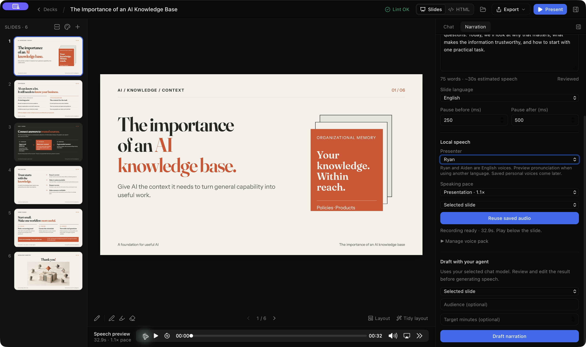

# Phase 2 — local stock speech

Implemented 9 October 2026 on `codex/narration-poc`. Automated checks, real worker smoke and **native preview acceptance passed**. Distribution qualification remains pending. No PR or push.

## Try it

Run `pnpm app:dev`. The speech build script compiles the pinned C helper on macOS, then starts the app. Developers need Python 3, Git, make and Apple command-line tools; users of the built bundle do not. The generated helper is bundled as a resource; model weights are installed separately. Windows/Linux builds currently support narration editing without native generation.

Open a deck → **Narration** in the right sidebar → **Local speech**. Choose a presenter, language and pace. The default **Presentation · 1.1×** applies pitch-preserving processing to the generated PCM; playback remains at normal speed. Each slide can override the deck language.

On first use, download the **2.50 GB** pinned CustomVoice pack, or choose **Import existing voice pack…**. The verified Phase 0 folder is `/private/tmp/slopslide-qwen-models/cv`, if still present. Import copies and verifies files into the app's data directory, avoiding another download. Cancelled/failed setup retains partial staging for a later retry. Verification occurs before promotion; failed setup is never advertised as installed. Removing the pack leaves deck recordings playable.

Write/draft a script and choose **Generate audio**, for the selected slide or visible scripts in the whole deck. Progress and Cancel appear in Narration. When ready, press **Play below the slide** using the native audio controls. The bar stays visible when switching back to Chat. It shows actual WAV duration. Editing the script, presenter, language or pace labels the accepted audio **Previous recording** until regenerated. Repeating unchanged generation reuses cached audio.

Silent slides, lead/tail pauses and complete narrated playback will be applied by Phase 3's shared timeline. Phase 2 previews the speech recording itself. Personal voice setup remains Phase 4; no microphone access is requested by this phase.

## Storage and runtime

- Pack: app-data `speech/models/custom-voice`; partial setup: `custom-voice.install`. Sizes/checksums are pinned in `src-tauri/speech-connector/data/custom-voice-pack.json`. Download URLs target an exact Hugging Face revision. Range resumes are checked against the expected Content-Range; servers ignoring Range restart that file.
- Audio: visible `audio/<uuid>.wav` under the deck, alongside `deck.html` and `narration.json`. Cache metadata stays in `.slopslide/speech/takes/<uuid>.json`. Earlier hidden WAVs are verified and copied into `audio/` on load without changing take IDs, accepted references or original files; no synthesis is required. `narration.json` references the accepted take ID. Recordings are immutable 24 kHz mono PCM16; metadata includes source, sample count, checksum, model revision and engine version. Old takes remain retained, including for snapshot references; automatic disk cleanup is deferred.
- Cache identity includes normalized text, language, presenter, pace, model revision and engine version. Visual changes and timeline pauses do not force synthesis. Previously accepted takes from older engine revisions remain playable.
- Generation captures source inputs, saves audio, then merges only the accepted-take reference if the current source still matches. Concurrent unrelated edits survive. Changed-source output stays cached but is not accepted. Errors/cancellation preserve prior accepted audio; temporary segment files are cleaned up.
- One active speech job per app process; OS model locks prevent pack mutation while another process uses it. The resident helper unloads after two idle minutes and is killed on cancellation/error. Its stdin closure also stops generation. No public HTTP server or executable model downloads.
- Long scripts split at sentence/word boundaries into at most 350-character passages, joined with 120 ms silence. Truncated or excessive worker output is rejected; the per-slide recording limit is ten minutes. Broader long-script quality is not yet verified.

## Pinned dependencies

The [Qwen C runtime](https://github.com/gabriele-mastrapasqua/qwen3-tts) is pinned to `ef339be58a778b062e1c14382347964552eae007`, compiled for portable macOS CPU instructions with Accelerate, BF16 and no Kleidi packing. Four threads, seed 42, temperature 0.9, top-k 50, top-p 1.0 and repetition penalty 1.05 retain the accepted PoC configuration.

The [official CustomVoice pack](https://huggingface.co/Qwen/Qwen3-TTS-12Hz-0.6B-CustomVoice/tree/85e237c12c027371202489a0ec509ded67b5e4b5) is pinned to `85e237c12c027371202489a0ec509ded67b5e4b5`. Nine presets are offered, with English/German selection. Ryan and Aiden are English stock voices; preview cross-language pronunciation.

The pace implementation vendors unmodified [Sonic](https://github.com/waywardgeek/sonic/tree/b93885dcb70aae50c6f76b0fe4e0868f029a077e) at `b93885dcb70aae50c6f76b0fe4e0868f029a077e` with its Apache 2.0 license. The build carries Qwen C, Ingot, LZ4, Sonic and model notices into the runtime resource directory. Generated binaries and weights are ignored by Git. Signing, Store packaging and a complete final dependency-notice audit remain Phase 5.

## Verified and remaining

`./check.sh` passed **848 frontend tests and 310 Rust tests**, with four opt-in live tests ignored; typecheck/build, rustfmt and clippy passed. Coverage includes setup cancellation/resume using tiny local files, checksums, interruptible network waits, worker protocol/cancellation, cache corruption/identity, source conflict acceptance, stale UI events/deck loads, saving presenter/pace and preserving prior recordings. The named debug app bundle builds successfully (roughly 52–54 MiB for these debug builds).

`dev/speech-smoke.py` ran against the actual compiled helper and pinned local model. English: 11.76 s; German at 1.1×: 10.237 s; English at 1.1×: 11.049 s. Native DSP sine tests check duration and pitch. Hard cancellation returned in about 0.038 s without an incomplete WAV. A restarted helper reproduced the original English bytes, which also match the Phase 0 recording. Retained [machine-readable results](narration-phase2-smoke.json) describe this one run, not a benchmark. The user approved the earlier 1.1× audition; this Sonic implementation has not yet received a separate human listening judgment.

**Native acceptance on retry:** the library opened, and the native picker imported/verified the full existing pack. Generating the saved 75-word opening produced **32.89625 s**, 789,510 samples at 24 kHz, SHA-256 `65307647ce33bcd9bce3fb56443a9fcf089e0fd9e8e3392612b6498fbd6b9542`. Playback advanced to 22 s and the native backward-seek button moved the paused position from 28 s to 13 s. Chat retained the player; closing/reopening the deck restored its duration and controls. Reuse completed within the next roughly 0.5-second UI observation; the accepted ID, WAV checksum and take count remained unchanged. Original script text, other entries, language/presenter and lead/tail pauses were preserved. Temporary jobs were cleaned up. A later process inspection confirmed the resident helper exited after the idle timeout while the app stayed open.

The debug build initially spent a long time in unoptimized SHA-256 verification. `profile.dev.package.sha2` now uses optimization level 3, retaining the full checksum check; the rebuilt preview reached real synthesis promptly. One process sample during generation showed helper RSS 3,158,096 KiB and app RSS 129,168 KiB. This excludes separate WebKit processes and is neither peak nor total-app memory.

The earlier `Interrupted system call` library failure recovered on retry. Rebuilding reproduced the intermittent access failure; one retry stalled the synchronous UI command. Library enumeration now runs on a blocking worker thread so macOS/filesystem waits leave the window event loop free, and successful retry clears the obsolete toast. The underlying filesystem cause remains unknown. After moving the read off the UI thread, the rebuilt preview opened the library and restored the same recording after a full app restart; native playback again advanced normally. The screenshot below records this final ready-to-play build.

Also pending: a full HTTPS download/resume on a clean machine, broader preset/long-script quality, total app memory and baseline hardware. The tested engine used roughly 3 GB in Phase 0; an 8 GB system and Intel Mac were not tested. Keep those checks before support/distribution claims. [Phase 2b.1–2b.3](narration-phase2b.md) now implements the provider boundary, reusable connector and capability-driven UI. That handoff records the new tests/model regression and passed native playback/restart/legacy reuse check; ElevenLabs/MCP remain planned. Phase 3’s timeline and MP4 integration is implemented and verified; next feature: Phase 4’s saved presenters. The connector extraction keeps accepted recordings in the deck’s visible `audio/` folder, as established by the audio-storage follow-up. Native reopening copied the existing accepted WAV with identical SHA-256 and byte-for-byte unchanged `narration.json`; playback still worked. **Show deck folder** opened Finder with `audio` visibly alongside `assets`, `deck.html` and `narration.json`. The retained screenshot predates that location hint.
