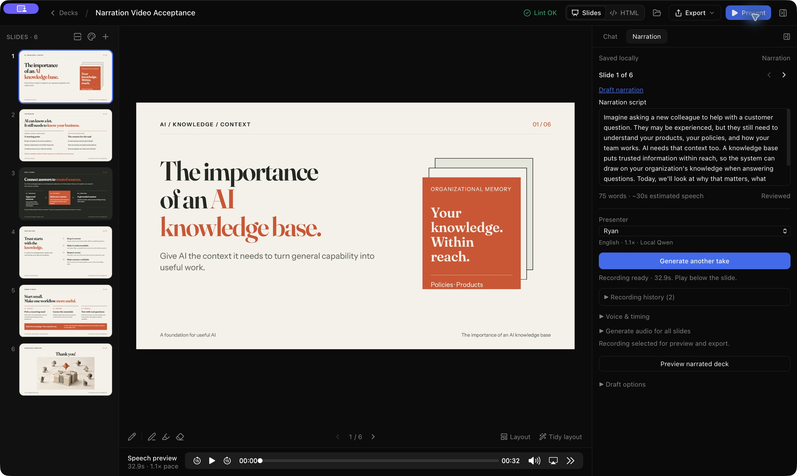
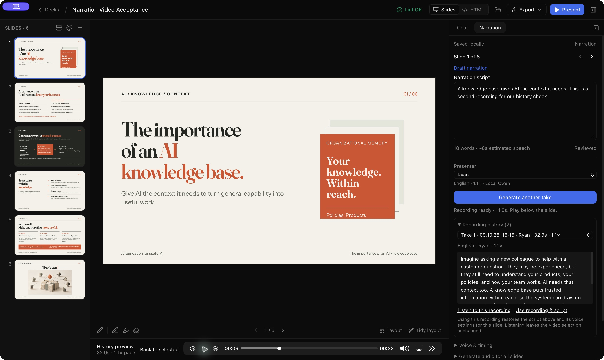

# Recording history and simpler narration — 9 October 2026

Implemented as a pragmatic follow-up to Phase 3. The next feature remains Phase 4 saved personal presenters. This change adds recording selection and simplifies the right Narration sidebar; speech engines and the reusable connector contract are unchanged.

The main view shows the selected slide, **Draft narration**, script, word/duration estimate, presenter and **Generate audio / Generate another take**. **Preview narrated deck** opens the existing full-deck preview. Language, provider, pace, pauses and deck defaults sit in **Voice & timing**. Whole-deck generation and draft preferences are separate closed disclosures. Empty scripts still start with an editable 5-second silent duration. Chat remains on the right; audio playback remains below the slide.

**Recording history** lists takes for this slide with a date, presenter, pace and duration, and shows the selected history item's original script. **Listen to this recording** starts temporary playback without changing the script or video selection; **Back to selected** returns to the accepted recording. Choosing a different history item stops its previous preview. Navigation clears temporary playback. **Use this recording** restores its voice/language/pace, while **Use recording & script** also explicitly restores the displayed original words. Other slides, deck defaults and timeline pauses are preserved. Restored different text needs visual review again. A matching accepted take is labelled **Selected for video**.

A fresh take bypasses reuse, gets a new immutable recording ID and becomes selected only when its source still matches. Existing audio stays in the deck's visible `audio/` folder. Failure/cancellation retains previous accepted audio. Whole-deck generation reuses a matching selected take before searching other cached recordings. The local deterministic engine can sound identical for unchanged input; no sampling defaults or speech quality settings changed.

Backend-owned immutable links in `.slopslide/speech/history/` associate stable slide IDs with take IDs, including superseded results and shared cached takes. Legacy accepted references and retained `.slopslide/narration-snapshots/` recover older associations. Unreferenced pre-feature recordings cannot reliably be attributed to a slide and are not guessed from matching text; their files remain intact. Corrupt/deleted historical audio is omitted without hiding usable recordings. No narration schema bump or take/cache-key migration is needed. The new commands are `speech_history` and `select_speech_take`; `generate_speech` adds an optional `fresh` flag. Selection drains frontend edits, validates membership/audio integrity, and uses the current narration fingerprint for one atomic source/accepted-ID update. Concurrent file changes reject selection and preserve local edits.

Validation: `./check.sh` passes with **882 frontend tests and 337 Rust tests** (325 app, one startup integration, 11 connector; five opt-in tests ignored), typecheck/build, format and clippy. Regressions cover slide ownership, legacy snapshot recovery, corrupt audio, stale fingerprints, restoring words/settings while preserving timing/other slides, fresh bypass, selected-take reuse, temporary preview, navigation and closed advanced controls.

Native acceptance on the disposable **Narration Video Acceptance** deck: generated an 11.8-second alternate script recording, retained the original 32.9-second recording, previewed the original with native playback while the alternate remained selected, then restored the original script/take through **Use recording & script**. Full-deck preview prepared successfully at 58.7 seconds. The original WAV retained SHA-256 `65307647ce33bcd9bce3fb56443a9fcf089e0fd9e8e3392612b6498fbd6b9542`. The alternate remains in history. The user's original deck was not edited. This verifies selection/preview preparation; MP4 encoding was already qualified in Phase 3 and was not rerun for this UI change.
