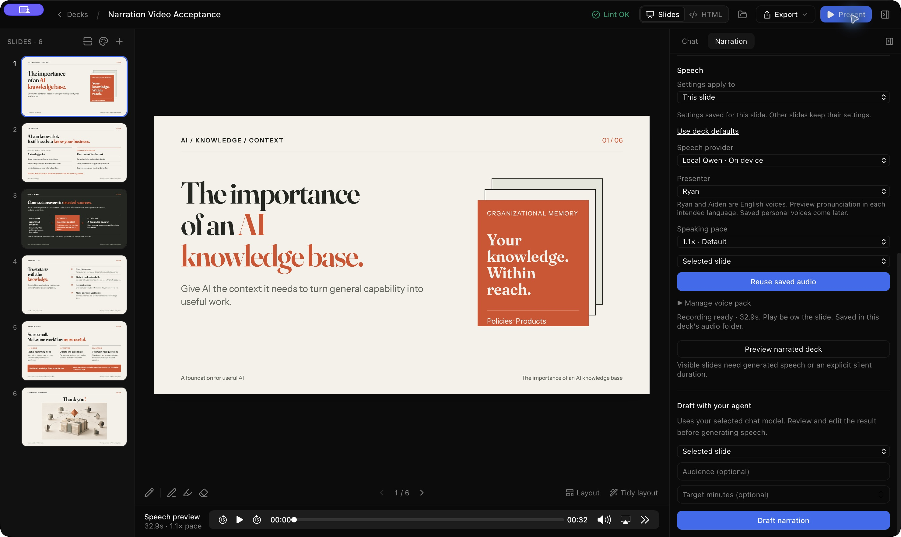

# Per-slide speech settings — 9 October 2026

The provider/presenter/pace controls previously edited deck-wide settings even while displaying one slide. That made earlier recordings stale and blocked video export. They now default to **This slide**; explicit **Deck defaults** edits affect only inheriting slides. Scope returns to This slide when navigating to another slide/deck.

A slide-specific edit pins the resolved provider, presenter/name and pace together. **Use deck defaults** clears those overrides. Language, lead/tail pauses and silent duration keep their existing per-slide controls. Generation scope remains separate from settings scope; whole-deck generation resolves each slide's actual provider/voice/pace.

For an already-stale recording, choose **Restore recording settings** on that slide if the script is unchanged. This restores its recorded provider/voice/language/pace without synthesizing again or replacing the script/take. If the words changed, regenerate speech. Video readiness now distinguishes changed text from changed speech settings and names this recovery action. Visual review warnings do not invalidate audio.

Narration schema 3 adds optional nullable speechProviderIdOverride, presenterIdOverride, presenterNameSnapshotOverride and paceOverride. Versions 1/2 migrate in memory, retain their file fingerprints and settings/take references, and write version 3 on the next validated save. Unknown versions remain errors. Accepted WAVs and legacy cache identities are unchanged. Agent narration schema guidance and draft instructions preserve the new overrides. Only narration schema changed; slide markup/runtime/linter rules are unchanged.

Checks: ./check.sh passes with 870 frontend tests, 322 app Rust tests, one startup integration test and 11 connector tests (334 Rust total); five opt-in tests ignored. Regressions cover per-slide UI edits versus explicit defaults, scope reset on navigation, restoring an old take, independent recording status, save/reopen/duplicate/migration, invalid overrides, mixed provider/voice/pace export and original PCM preservation. Native UI acceptance passed on the disposable six-slide knowledge-base copy: changing slide 2 to 1.2× retained slide 1 at Ryan/1.1× and Recording ready; changing slide 1 to Aiden blocked video preparation with the recovery action named; Restore recording settings returned it to Ryan/1.1× without generation; the complete 58.7-second video preview then prepared successfully. The accepted take ID and WAV SHA-256 remained unchanged (65307647ce33bcd9bce3fb56443a9fcf089e0fd9e8e3392612b6498fbd6b9542). The saved manifest retained deck Ryan/1.1× defaults and distinct slide overrides. Only the disposable copy was edited.

Next feature remains Phase 4 saved personal presenters. This fix changes speech selection storage and source resolution, not speech quality, cloning or video encoding.
