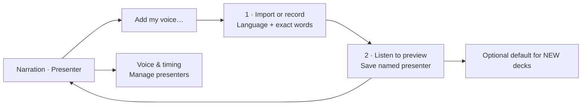
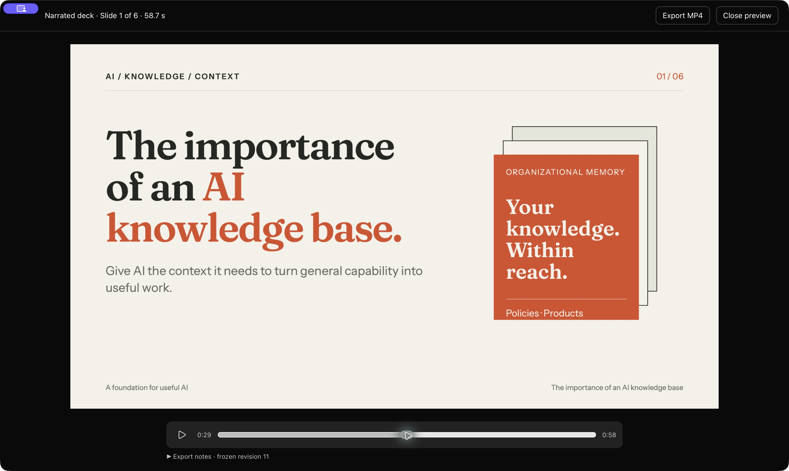

# Narration and presentation video export

Proposal — 8 October 2026; PoC, Phase 1 and native Phase 2 acceptance completed 9 October 2026. Provider architecture revised and native Phase 3 PoC acceptance completed 9 October 2026. Explicit pauses and narration skill implemented 10 October; saved-presenter and delivery-control follow-ups planned below. See the [feasibility report](narration-feasibility.md).

**Decision:** use exchangeable backend speech providers, with the native C Qwen3-TTS 0.6B CPU candidate as the local default, BF16 with Kleidi packing disabled. Extract its engine/model/pace handling into a reusable connector; expose an optional separate MCP wrapper for other applications. ElevenLabs and future connectors use the same provider contract. See the [provider architecture and implementation steps](speech-provider-architecture.md). Local stock English/German speech, reusable human-reference presenters, resident model reuse/cancellation, signed sandbox CPU inference and a native one-slide MP4 have working evidence. Engine peak memory was approximately 3.0–3.1 GiB on the tested M4 Pro/48 GiB Mac. This is sufficient for the PoC; minimum hardware, full-app behavior and App Store eligibility remain unverified.

## Current status and session handoff

Last updated: 10 October 2026. **Phase 0 is complete at PoC scope. Phase 1 is implemented and checked. Phase 2 is implemented and passed native preview acceptance; broader installation/device checks remain pending. Phase 2b.1–2b.3 is implemented with unit/standalone model checks and native playback/restart/legacy reuse acceptance passed. Phase 2b.4 ElevenLabs and Phase 2c MCP remain planned. Phase 3 is implemented with a native 10-minute export and app preview/export/cancellation acceptance passed; extended device/Store qualification remains pending. Explicit pauses, recording history and the narration skill are implemented. Phase 4 saved presenters is implemented at PoC scope, with automated/actual-model checks and native import/play/save/reuse acceptance; live microphone and broader qualification remain pending; Phase 4b tone/delivery controls is planned and requires a feasibility gate. Phase 5 has not started.** The user explicitly narrowed the remaining work to a pragmatic proof of concept, not final-product qualification. The earlier status treated broad corpus/device/integrated Store checks as phase-0 blockers; those checks now belong to the relevant implementation/distribution milestones below. They have not been marked as passed.

### Completed PoC evidence

- [x] Concept, right-sidebar Chat/Narration layout and saved-presenter semantics documented; standalone mockup stored with the plan. Its controls are simulated and predate the saved-presenter refinement.
- [x] Official 0.6B CustomVoice/Base packs pinned, sizes/checksums verified; native C built and self-tested.
- [x] Official Qwen reference comparison and user listening: native BF16 preferred, lower-memory BF16 close, German stock speech approved. The user approved a pitch-preserving 1.10× audition for longer English.
- [x] A roughly 16 MB saved Base profile reused in fresh processes without the recording/transcript. German-reference clone likeness accepted; English usable with a slight accepted accent. An English-reference clone retained an unwanted American accent in German, including official Qwen output.
- [x] Resident API probe loaded one model, generated English/German, cancelled after eight frames, then reproduced the first English WAV byte-for-byte. Peak RSS 3.037 GiB; load 1.612 s, later repeat 4.896 s for 11.76 s audio. This is a single diagnostic run, not full-app/baseline qualification.
- [x] Ad-hoc and Apple Development signed App Sandbox probes loaded bundled CPU models/worker, wrote private-container audio and exited. Outside-file denial and an unsandboxed negative control verified enforcement.
- [x] Hidden WKWebView snapshot and AVFoundation one-slide H.264/AAC MP4 verified. Source/AAC alignment confirms the original slow pace came from synthesis, not export.
- [x] Engine/source/build and licenses reviewed; the Apple Make compatibility patch is retained. Final notices and a Kleidi vendored-provenance discrepancy remain release tasks.
- [x] Repository checks passed: 677 frontend tests, 224 Rust tests, typecheck/build, formatting and clippy.

Evidence: [initial review/measurements](narration-feasibility.md), [listening clips and replies](feasibility/listening-2026-10-09/README.md), [resident-model results](feasibility/resident-2026-10-09/README.md), [sandbox result](feasibility/listening-2026-10-09/sandbox-results.json), [runtime audit](feasibility/listening-2026-10-09/runtime-audit.md), [narrated MP4](feasibility/narrated-slide.mp4), and [reproduction/test cases](../dev/feasibility/README.md).

### Phase 1 implementation and handoff

- [x] Chat/Narration tabs in the existing right sidebar; both panels stay mounted across tab switches. Chat drafts and attachments survive switching; the existing agent continues in the background.
- [x] `narration.json` version 1 beside `deck.html`, with stable slide-ID keys, revision/fingerprint checks, English/German defaults/overrides, script text, timing defaults, silent-slide duration and review fingerprints. Old decks do not create a sidecar until edited.
- [x] Debounced script saves drain changes made during an in-flight write. Deck switches/close/drafting/duplicate/delete flush edits first; a failed save retains the text and opens Narration.
- [x] Optional selected-slide/visible-deck agent drafting with audience/target minutes. Existing configured provider/model is reused. Review narration returns to the drafted slide. Agent writes use new `read_narration` / `write_narration` MCP tools, validated atomic replacement, file fingerprints and a shared OS filesystem lock (`fs2`); conflicts require rereading/merging.
- [x] Watcher reloads narration independently of HTML/assets. External conflicts offer **Use file version** or **Keep my edits** (merges edited fields onto the file version). Corrupt/unsupported manifests display an error and are never silently replaced.
- [x] Reordering retains ID associations; duplicating copies scripts without upgrading unreviewed text to reviewed. Deleted/renamed IDs remain as recoverable entries, with a copy-to-selected-slide action. Restoring the same ID recovers its script. Markup/shared-style changes flag existing scripts for review.
- [x] Deck snapshots include narration source under matching filenames in `.slopslide/narration-snapshots/`, pruned alongside HTML snapshots. Phase 2 retains immutable audio takes separately.
- [x] `./check.sh`: **831 frontend tests, 295 Rust tests** (4 opt-in live tests ignored), TypeScript/build, Rust formatting and clippy all pass. Browser preview checked at the app's default 1480×920 size: right-side layout, local preview save/reopen, draft preservation and Review narration action. Backend tests cover actual temporary-file persistence, corruption, conflicts, simultaneous writers, duplication, restoration and snapshot pruning.

See [implementation notes](implementation/narration-phase1.md) and [actual UI screenshot](implementation/narration-phase1.jpg). This screenshot is the app's browser preview, using preview-only localStorage for narration; desktop saves use the Rust sidecar commands. Upstream main `cc5a2bb` is merged, including Codex interactive permission handling absent from the initial preview. The rebuilt native preview was opened with the existing deck and verified to offer Codex Ask mode. A real installed-Codex read_narration approval/result smoke passed on a disposable deck; read/write approval routing and draft review are covered by regression tests. A complete live draft/write on a user deck remains to be tried. A native-binary MCP stdio smoke also verified reading, saving and stale-write rejection. Leave Ask selected, approve the tools in Chat when requested, then review the script in Narration. Phase 2 now implements speech setup/preview, stock presenter controls, accepted-take/cache handling and job progress, as described below. The earlier UX mockup remains illustrative of later phases.

### Phase 2 implementation and handoff

- [x] Bundled pinned macOS CPU helper: BF16/no-Kleidi, four threads, resident model reuse and private versioned stdio. No end-user Python, FFmpeg or paid service. Native Sonic pace processing keeps pitch; default 1.1×.
- [x] One-time 2,498,383,610-byte CustomVoice pack setup: pinned HTTPS download or existing-directory import, resumable staging, exact size/SHA-256 verification, progress/cancel and removal. Installation and worker use coordinate through an OS file lock.
- [x] Presenter and pace selectors in the right Narration tab; generation for the selected slide or visible scripts in the deck. English/German, nine stock presets, actual recording duration and audio controls below the slide. Chat stays on the right.
- [x] Immutable WAV takes in the deck’s visible `audio/` folder, with source/settings/engine/model cache keys. Internal metadata stays in `.slopslide`; earlier hidden recordings copy over after verification without changing references. Generation flushes edits and accepts audio only if its source still matches. Failure/cancellation preserves earlier accepted recordings. Worker unloads after two idle minutes.
- [x] Real helper smoke: English 11.76 s, German 10.24 s, paced English 11.05 s. Native DSP pitch/duration self-test passed; hard cancellation produced no incomplete WAV; restart reproduced original English bytes.
- [x] `./check.sh`: **848 frontend tests, 310 Rust tests** (4 opt-in tests ignored), typecheck/build, rustfmt and clippy pass.
- [x] Native app import → generate → play/seek/reopen → reuse acceptance. The verified local pack installed through the native picker; the existing 75-word opening generated a 32.896 s recording. Playback time advanced, native seek worked, switching to Chat kept the player visible, and reopening restored the recording. Reuse retained the same take/WAV without synthesis. Scripts and timing settings were preserved. The earlier library error recovered on retry; its underlying cause remains unknown. Library reads now run off the UI thread, and successful retry clears the stale error message. A final full-app restart opened the library and played the same saved recording.
- [ ] Full network download/resume on a clean machine, broader presets/long scripts and total-app memory measurement. Tiny-file installer tests and worker smoke do not establish clean-install support.

See [implementation details and retained smoke results](implementation/narration-phase2.md).

### Checks carried into implementation

| Check still unproven | Where it belongs |
| --- | --- |
| Clean network installation, broader stock corpus/seeds, total app memory | Phases 2/5 |
| Cloud adapter and independent MCP consumer | Phases 2b.4/2c |
| Unusual assets/generated media, actual full-volume disk behavior, forced-quit recovery | Phases 3/5 (extended qualification) |
| User's own voice, live microphone check and broader clone likeness/pronunciation; import/default presenter UX now implemented | Phase 4 qualification / Phase 5 |
| Baseline-device support claims, cold/clean-machine installation, integrated Store sandbox/file permissions, distribution signing and final notices | Phases 2/5, before advertising support/distribution |
| Native Windows/Linux inference and encoding | Phase 5 |

An 8 GiB Mac was not tested. No full-product quality or Store promise follows from this PoC. Recommend setup recording in the primary narration language and preview every intended language; accent removal is not guaranteed.

### Per-slide speech settings follow-up

Provider, presenter and pace now default to **This slide** in Narration; choose **Deck defaults** explicitly for inherited settings. Editing a slide pins its resolved provider/voice/pace without changing other slides. **Use deck defaults** clears its speech overrides. Language and pauses remain per-slide. **Restore recording settings** recovers a stale recording when its script still matches. Narration schema 3 migrates versions 1/2 without changing source settings or accepted take references. See the [follow-up handoff and actual native screenshot](implementation/narration-slide-settings.md).

### Recording history and simpler narration — 9 October follow-up

The Narration tab starts with a sticky Presenter picker and a prominent **Create voice from recording…** action above the script. **Manage presenters** sits directly below the picker. The selected slide shows its script, **Draft narration**, generation state and **Preview narrated deck**. Language/pace/provider/pauses/deck defaults move into **Voice & timing**; whole-deck generation and drafting preferences use separate closed disclosures. Silent slides still show their effective 5-second duration. Chat stays in the right sidebar and playback stays below the slide.

**Recording history** lists that slide’s takes with date, presenter, pace, duration and original script. **Listen to this recording** previews without changing the video selection. **Use this recording**, or **Use recording & script** when the words differ, explicitly restores its source and accepts it for preview/export. **Generate another take** bypasses cached audio and preserves earlier takes. Local deterministic synthesis can sound identical for unchanged inputs; no sampling/quality defaults changed. See the [implementation handoff and actual native screenshots](implementation/narration-recording-history.md). This live layout supersedes the earlier mockup’s crowded narration controls.

### Explicit pauses and narration skill — 10 October follow-up

Narration supports `[pause:800ms]`, inserted at the cursor with **Insert pause** and editable as milliseconds in the script. The estimate counts spoken words and includes explicit pause time. The reusable connector compiles speech passages and adds exact silence after speaking-pace processing. Existing marker-free narration and cache keys are unchanged. Unsupported tone/stage-direction/SSML markers block generation; the editor retains editable drafts. A bundled narration skill and model-specific guidance accompany `read_narration`; agent writes validate changed scripts. Qwen 0.6B instruction-driven tone remains unsupported. See the [implementation notes and native evidence](implementation/narration-pauses.md).

### Planned tone and related narration features — Phase 4b

**Planned, not implemented.** Keep local 0.6B as the default. [Official Qwen inference](https://github.com/QwenLM/Qwen3-TTS/blob/main/qwen_tts/inference/qwen3_tts_model.py#L729-L733) explicitly disables `instruct` for 0.6B CustomVoice. [Qwen's model table](https://github.com/QwenLM/Qwen3-TTS#model-description) lists instruction control for 1.7B CustomVoice. That is a candidate for an optional expressive local pack, not evidence that the pinned native worker supports it. Also evaluate provider-native delivery controls when the ElevenLabs adapter is implemented; do not assume equivalent controls across models or presenters. Tone with cloned profiles is a separate capability and must not be inferred from stock-voice instruction support.

| Feature | Scope and priority | Evidence needed before enabling |
| --- | --- | --- |
| Per-slide tone/delivery | First Phase 4b feature: a small **Delivery** selector under **Voice & timing**, initially **Default** plus a few tested styles such as Conversational, Calm or Energetic | Audible differences with the same words/voice; English/German clarity and pacing; native runtime support, model size, generation time and peak memory measured. Style names are proposals until listening passes. |
| Pronunciation overrides | Follow-up: deck pronunciation list for names/acronyms, with a preview of the spoken substitution; provider-native dictionaries/phonemes only where verified | Visible slide text remains unchanged; substitutions are deterministic and included in take provenance/cache identity; regression samples cover technical terms and German names. Current editable spoken wording remains the fallback. |
| Passage-level emphasis or delivery | Later, only if useful after per-slide styles; a versioned structured control compiled by the connector | Actual provider/model support, voice continuity across passages and no spoken control tags. Do not accept arbitrary `[happy]`, `[tone:...]` or SSML before the renderer supports them. |
| Captions (SRT/VTT) | Separate later feature using alignment against the accepted recording | Word/phrase timing verified against actual audio and explicit pauses; no timestamps inferred from word counts. |

Implement Phase 4b in two steps:

1. **Bounded feasibility test:** try one compatible expressive model with neutral and two contrasting deliveries on short English/German passages. Compare with current 0.6B speech, measure download/storage/memory/time, test cancellation, and ask the user to listen. Use the existing public reference for any clone experiment; a stock-voice pass does not qualify cloned delivery. If native support or quality is unsuitable, record the result and keep the feature planned rather than adding an unverified UI or an automatic cloud fallback.
2. **Connector, source and UI integration after a pass:** extend capabilities with supported delivery IDs, model/voice compatibility and provider guidance. Resolve style instructions inside the adapter, separately from spoken text. Persist per-slide overrides and explicit deck defaults with a versioned migration; include resolved delivery/model/profile revision in cache and history metadata. Old scripts/takes retain their default behavior. Switching to an incompatible provider/profile requires an explicit supported choice rather than silently ignoring the style. Extend the narration skill from those verified capabilities. The frontend renders one compact selector; optional model setup discloses its measured requirements.

Acceptance cases: unsupported controls fail before synthesis; default delivery preserves old source/cache behavior; changing one slide's delivery leaves others and earlier takes intact; history restores its original script/settings/delivery; cancel/failure preserves accepted audio; pause durations remain exact after pace/style processing; preview and export use the selected take; missing expressive packs report setup requirements without downloading code or invoking cloud services. Unit/fixture tests cover validation, migration and caching; listening verifies delivery and pronunciation.

### Phase 4 saved presenters — implemented

**Create voice from recording…** now opens a two-step recording/transcript → preview/save flow above the script. Reference import is the first primary action; name and language are visible immediately; transcript appears after a recording is chosen. **Record here** shows the passage before the separate **Start recording** action. A five-second spoken microphone warm-up is discarded before the main passage is retained. Preview offers an editable name and **Record again…**, retaining the chosen name. Save is available when the primary-language preview succeeds, without a hidden playback timer. Voice creation also works without a selected slide. Model-folder import is a separate advanced action; if needed, the disclosed 2.52 GB model download and preview creation use one button. Import or record a 3–30 second reference, verify its exact words, listen, then save a named presenter. A separate pinned 0.6B Base pack powers cloning; compact reusable conditioning stays private to the app. Saving selects the voice for the current slide; the optional default applies only to new decks. Manage presenters supports rename, reference replacement and deletion. Existing deck audio remains playable/exportable even when a profile changes or goes missing.

The public-reference German/English previews passed user listening. Actual-model reuse/reopen/cancel and unchanged stock regression passed; native import, playback, save, another deck, rename and new-deck default checks passed. See the [Phase 4 implementation, reproduction and limits](implementation/narration-phase4.md). Live microphone capture/permission acceptance, full test-deck voice quality, crash-orphan cleanup and device/Store qualification remain pending. No new recording from the user is required while they have a cold. Tone controls, cloud integration and the separate MCP package remain planned.



### Phase 3 implementation and handoff

Narration now offers **Preview narrated deck**, with play/pause/seek and synchronized frozen slide images. **Export → Narrated MP4** produces static 1080p/30 fps H.264/AAC video through the bundled macOS helper, with progress and cancellation. Slides with scripts need current accepted speech; slides without narration use an editable 5-second silent duration by default. Export uses the provider-independent accepted recordings; Qwen is not part of the video renderer.

Native 10-minute export, six-slide app preview/export, resize and cancellation checks passed. See the [Phase 3 handoff and limits](implementation/narration-phase3.md) and [verification evidence](implementation/narration-phase3-smoke.json).



### Resume here in another session

1. Read `CLAUDE.md`, this plan and the reproduction README. **Phase 4 is implemented at PoC scope; read the [saved-presenter handoff](implementation/narration-phase4.md). The next feature is Phase 4b’s bounded delivery feasibility gate**; no tonal controls are currently supported. Read the [pause/skill handoff](implementation/narration-pauses.md), [recording-history handoff](implementation/narration-recording-history.md) and [Phase 3 handoff](implementation/narration-phase3.md). Also read the [Phase 2b handoff](implementation/narration-phase2b.md) for the passed native playback/restart/cache migration checks. The provider contract, reusable Qwen connector and generic UI are implemented; follow the [provider architecture](speech-provider-architecture.md) for later cloud/MCP steps. Read [Phase 2 implementation notes](implementation/narration-phase2.md) for the verified setup and playback flow. Keep the outstanding clean-install/device checks before support and distribution claims. Keep local Qwen as the default, explicit opt-in cloud use without paid fallback, right-sidebar layout and saved-presenter semantics. Qwen and an opt-in development fixture use the provider abstraction; ElevenLabs and MCP are not implemented.
2. Use the pinned C/BF16/no-Kleidi configuration as the prototype starting point. The official Python environment and FFmpeg auditions are development tools, not end-user dependencies.
3. Reuse scratch resources if they still exist and match hashes; `/private/tmp` may be cleared. Rebuild/download from pinned instructions if absent.

| Scratch resource | Local path |
| --- | --- |
| C checkout / CLI | `/private/tmp/slopslide-tts-feasibility-c/` / `qwen_tts` |
| Model packs | `/private/tmp/slopslide-qwen-models/cv/` and `/private/tmp/slopslide-qwen-models/base/` |
| Saved public-reference profiles | `/private/tmp/slopslide-lj-public.qvoice` and `/private/tmp/slopslide-thorsten-public.qvoice` |
| Initial raw evidence | `/private/tmp/slopslide-tts-evidence/` |
| Resident probe output | `/private/tmp/slopslide-resident-poc-2026-10-09/` |
| Development signed sandbox probe | `/private/tmp/slopslide-sandbox-devsigned-2026-10-09/` |
| Official reference Python | `/private/tmp/slopslide-qwen-official-venv/` |

The plan, mockup, PoC probe sources and retained evidence are committed locally on **`codex/narration-poc`**. The branch is published to `the-ulib/slop-slides` as `codex/narration-poc`; upstream `origin` rejected pushing for this account. No PR has been created. Phase 1 now adds production narration source storage, checked agent tools and the right-sidebar script editor. Phase 2 now integrates stock speech generation and playback. Large model packs, generated helper executables and presenter profiles are excluded from Git; pinned build sources and notices are retained.

## Product concept

Turn a deck into a narrated video using an interchangeable speech provider, a shared slide timeline and a native MP4 encoder. Local Qwen3-TTS 0.6B is the default: once models and deck assets are available locally, synthesis and export require no network and incur no API charges. Optional ElevenLabs/cloud connectors require explicit selection and their own credentials, network access and provider charges; no automatic cloud fallback occurs. Optional script drafting still uses the user's configured agent and its existing costs/data handling.

First local video PoC: English and German; a deck default voice with per-slide overrides; editable narration for every slide; local preview; 1920×1080 H.264/AAC MP4; static slides at their final visual state. Voice cloning is the next milestone on the same architecture. No promise of real-time synthesis or universal hardware support before measurements.

Mac is the first complete video-export target. Preserve platform-neutral narration and timeline interfaces, then add Windows/Linux video backends. Do not make cloud TTS a dependency or automatically fall back to a paid provider.

## User experience

### Interactive mockup

Open the [narration experience mockup](mockups/narration-experience.html) in a browser. This standalone copy is stored with the plan so it remains available outside the chat. It includes these interactive views:

- **Editor:** slide thumbnails, center preview and Chat/Narration tabs in the right sidebar. Select slides, edit a script and simulate regeneration.
- **Local speech setup:** open **Speech settings** to explore installed voices and optional cloning setup.
- **Voice setup:** choose **Use my voice…**, then record/import to explore the sample, transcript, permission and preview steps.
- **Video export:** choose **Export video** to explore preparation, progress and completion.

This is a UX prototype: recording/import, speech playback, generation and video export are simulated. It does not generate files or access a microphone. The optional below-slide placement control has been removed from this saved copy.

The mockup illustrates the initial flow and predates the saved-presenter refinement and provider selector. Provider switching/cloud setup are specified in the [provider UX requirements](speech-provider-architecture.md#minimal-frontend-and-presenter-experience), not yet drawn in the mockup. Its **Voice / Use my voice…** controls must become **Presenter / Create voice from recording…**, with presenter management, a default-for-new-decks checkbox and persistent profiles. Those behaviors are specified in the plan but are not implemented in this mockup. The written requirements below take precedence where the prototype differs.

### Editor layout and workflow

Keep the existing three-column editor: slide thumbnails on the left, the slide preview in the center, and the existing right sidebar. **Chat** and **Narration** are tabs in that right sidebar. Chat remains on the right; switching tabs replaces the sidebar content while keeping the selected slide visible. The area below the slide holds compact playback controls and status only. There is no bottom-panel or alternative-position setting for Chat or Narration.

1. Select the **Narration** tab in the right sidebar. It shows the selected slide's script, voice, language, preview control and generation state. If a toolbar shortcut is provided, it opens this same tab.
2. Choose **Draft narration** for a slide or the whole deck, or write it manually. An optional audience and target duration guide drafting. The script explains the slide rather than reading every visible word. Target duration is an estimate until audio exists.
3. Choose **Presenter** for this slide. Expand **Voice & timing** to change the **Speech provider**, pace, language, pauses or inherited deck defaults. The default is **Local Qwen · On device**; cloud choices identify remote processing and possible charges. **Speech settings** renders backend-supplied setup requirements: verified pack size/download/import for Qwen or account/credential setup for a cloud connector. Distribution of model resources for the Store build must pass the packaging milestone below.
4. Select a compatible presenter and language; generate a short preview. Show **Not generated**, **Generating**, **Ready**, **Needs regeneration**, or **Failed** for each slide.
5. **Generate audio** creates speech for this slide; **Generate another take** explicitly creates a fresh recording. **Recording history** previews and restores older takes, including their original script/settings. Whole-deck generation is an expandable action and reuses matching selected recordings. Failure/cancellation preserves previous accepted takes.
6. Preview the complete narrated deck with the same timeline that export uses. An empty script uses a 5-second silent duration initially, which the user can adjust.
7. **Export video** shows total duration and unresolved items, asks for a destination and renders a frozen copy of the deck. Report completion only after the MP4 has finalized successfully.

### Saved presenters and one-time voice setup

The Narration tab contains a **Speech provider** selector and a **Presenter** picker listing that provider’s preset voices and saved personal presenters, for example **Uli · My voice**. Language is a separate choice. **Create voice from recording…** and **Manage presenters** are available from the picker; users do not repeat voice setup for every deck.

Show **Create voice from recording…** only when the selected provider supports cloning. Profiles are provider-specific; switching provider does not convert a local Qwen profile or upload its reference automatically. Cloud setup must explain the upload and obtain the user’s explicit choice.

The local Qwen setup flow is **Narration → Presenter → Create voice from recording…**:

1. Name the presenter and choose the recording language, then **Import reference audio…** (PCM16 WAV, 3–30 seconds; suggest 10–20 seconds), or **Record here**. Read the localized passage before pressing the separate **Start recording** button. Speak the test phrase during a five-second microphone warm-up, then read the passage when the recording cue appears and stop after the last word. Warm-up samples are discarded before saving; only the main passage belongs in the transcript. Manual trimming/conversion are deferred.
2. Enter/check the exact spoken words and confirm permission to use the voice. The name is editable both before preview creation and beside Save on the preview screen. Changing the recording language retains the chosen file and transcript.
3. Choose **Create voice preview**. If the model is missing, the action is **Download model & create preview**, with its 2.52 GB size explained beforehand. **Already have the model files?** separately exposes **Import existing model folder…**; this does not import a reference recording.
4. Listen to the primary-language preview before saving. Save becomes available after preview generation, without depending on playback timing events. **Record again…** returns to passage preparation while retaining name/language; **Use another audio file…** returns to import. The localized passages are short practical references, not a benchmark-optimized corpus; manual correction is required for any skipped/changed words.
5. Edit the presenter name if needed, then **Save presenter**, with optional **Use as default presenter for new decks**. It appears automatically in the Presenter picker across decks; no separate voice-import step is needed.

For local Qwen, explain this as saving a reusable voice, not training a model. Qwen conditions synthesis on the saved reference recording and transcript; cache reusable derived conditioning where the selected engine supports it. Keep the original reference and versioned derived data locally so the presenter survives app restarts and can be reused without recording again. Do not upload these resources through the drafting agent or include them in HTML/video exports.

Each deck remembers its selected presenter. New decks copy the application default presenter at creation; later changes to that default do not change existing decks. Choosing another presenter marks the deck's narration as needing regeneration while retaining previous takes until replacement succeeds. The presenter picker and preview should be usable with preset voices before the cloning milestone ships.

**Manage presenters** supports renaming, previewing, replacing the reference recording, setting the default and deleting a presenter. Renaming does not invalidate audio. Replacing a reference creates a new profile revision; decks using that presenter require regeneration on their next load, with previous takes preserved. Local Qwen profiles belong to this computer initially; explicit profile export/import or synchronization is deferred. Cloud profiles belong to the selected provider account and retain that provider binding.

Deleting a local Qwen voice removes its reference and derived profile; explain that existing narration recordings and previously exported videos remain unless separately deleted. Switching computers can preserve rendered audio while requiring voice re-import to regenerate it.

If a presenter is missing or deleted, identify it by its saved display name and ask the user to choose a replacement before generating new speech. Existing accepted audio remains playable and exportable. Deleting the application default clears that preference; new decks fall back to an available preset or prompt for a presenter, never silently change an existing deck's voice.

Tab switching preserves the chat draft, conversation, narration edits and generation progress. A running agent or speech job continues when its tab is inactive. After drafting narration in Chat, a **Review narration** action opens the Narration tab for the selected slide. Changing slides updates the narration editor after preserving the previous slide's edits. Voice setup and export use dialogs, keeping the main editor layout stable.

## Local Qwen model and runtime decision

Use **Qwen3-TTS-12Hz-0.6B-CustomVoice** for stock voices and **Qwen3-TTS-12Hz-0.6B-Base** for cloning. These are distinct checkpoints: Base is not a preset-voice model. Install only the pack the user needs and share compatible tokenizer/codec resources. Load one model at a time. A cloning-first user can use Base without downloading CustomVoice.

The tested official packs occupy approximately 2.50 GB for CustomVoice or 2.52 GB for Base, including codec/tokenizer resources; both use about 4.33 GB when the identical speech-tokenizer weights are shared. The tested `--int8` flag quantizes at runtime and does not reduce these downloads. Installation/update needs additional temporary disk space. Show verified pack sizes in setup rather than inferring them from the 0.6B parameter count.

Continue with the native C implementation as the provisional Mac candidate: CPU inference, English/German, Base profile save/reload and native dependencies were reproduced. The Rust/Candle candidate compiled with Metal/Accelerate and generated a short WAV on Metal, but has not passed equivalent quality, memory or cloning checks. It remains an alternative. Use official Qwen inference as a quality reference during development; do not require Python on end-user machines. The C candidate documents Windows through WSL2 beta; shipping a native Windows application requires a separate inference portability spike as well as a video backend.

Qualify **BF16 with Kleidi packing disabled** first: user listening favors it and it used less RAM than the original int8 configuration on this host. Keep default-packed BF16 as the quality comparison. Do not prefer int8 merely from its label; test actual memory and speech quality, including cloning. Ship int8/4-bit only after equivalent acceptance. Do not equate a quantized transformer weight size with full installed size or peak RAM. Measure the tokenizer, speech encoder/decoder, buffers and app together.

The initial C tests used mixed precision even with `--int8`. Disabling Kleidi packing (`QWEN_NO_KLEIDI=1` at the tested revision) reduced measured peak memory, but changes numerical paths and sampled output. Treat it as an experimental configuration requiring listening and baseline-device validation. Neither this flag nor the 4-bit option establishes that the whole application fits an 8 GiB machine. Preserve the ability to revise supported hardware or engine selection before building the complete UI.

Use a bundled, versioned native worker with framed local IPC, no HTTP server, and no shell evaluation. Keep the model warm across a deck's generation job, unload after idle/low-memory notification, and enforce a single active synthesis job initially. The worker provides crash isolation and a hard cancellation boundary. Standalone CPU signing/inheritance passed; integrated Tauri lifecycle, file access and any GPU path still need proof early on macOS; an in-process adapter is the fallback if the worker architecture fails those tests.

Pin the engine revision, model revision, quantization recipe and resource checksums. Audit actual license files and transitive dependencies before adoption; a README license statement is insufficient for release. Downloads are allowlisted model data, never scripts, executable plugins or runtime updates.

## Exchangeable speech architecture

**Implemented Phase 2b.1–2b.3:** provider-specific speech code is outside React and deck/export orchestration. See [implementation and verification evidence](implementation/narration-phase2b.md). The [detailed architecture](speech-provider-architecture.md) defines ownership, contract, migration, MCP behavior and acceptance tests.

- The frontend selects provider/presenter and renders capabilities, setup, progress and playback. Voices, model facts, pace ranges and availability come from the backend.
- SlopSlide owns scripts, revisions, deck jobs, cache, validated audio import and video timing. It stores all accepted recordings in the deck’s visible `audio/` folder.
- A versioned backend `SpeechProvider` contract discovers capabilities/voices, synthesizes speech and reports progress/results/cancellation. Qwen, ElevenLabs and explicitly mapped MCP connectors implement it.
- A reusable Qwen connector owns pinned models, warm worker, segmentation, conditioning and Sonic pacing. It receives text/settings and returns an artifact; it has no slide/deck/Tauri dependency.
- A separate optional MCP server wraps the same connector for other apps. SlopSlide’s Generate button calls the backend directly without an LLM/chat roundtrip. The existing private worker protocol is not MCP.

The contract, Qwen extraction and fixture-provider interchange proof are implemented before Phase 3. Implement the ElevenLabs API adapter and independently usable MCP package as follow-up steps; paid/live cloud testing needs separate credentials and authorization. Do not claim either is supported yet.

## Data and integration design

Keep narration outside `deck.html` in a versioned, human-readable `narration.json` beside it. Existing HTML presentation/export behavior stays intact. The manifest is source data; generated audio is rebuildable, but useful for portable playback.

```text
<deck>/
  deck.html
  narration.json                 scripts, language, voice reference, pauses, accepted takes
  audio/                         immutable generated WAV takes
  .slopslide/speech/takes/        internal take metadata
  .slopslide/speech/history/      immutable slide-to-recording associations
  .slopslide/speech/jobs/         temporary speech jobs (current implementation)
  .slopslide/narration/jobs/      proposed resumable export manifests

<application support>/
  speech/models/                 verified model packs shared by all decks
  speech/voices/                 private reference recordings and derived voice data
```

Proposed manifest fields: `schemaVersion`, `revision`, `speechProviderId`, `presenterId`, `presenterNameSnapshot`, `defaultLanguage`, and `slides[slideId]` containing `text`, `languageOverride`, `speechProviderIdOverride`, `presenterIdOverride`, `presenterNameSnapshotOverride`, `paceOverride`, `leadInMs`, `tailMs`, `silentDurationMs`, `acceptedTakeId`, and `reviewedSlideHash`. `presenterId` is the deck's explicit choice, distinct from the application preference `defaultPresenterId`. The presenter registry maps stable IDs to provider-namespaced voices/profiles, recording their display names, provider bindings, revisions and compatible model identifiers. Migrate version-1 decks explicitly to `qwen-local`, preserving selected voices, pace, take IDs and files; migrate cache metadata so unchanged local narration remains reusable. Existing audio remains playable/exportable with the provider unavailable. Keep reference audio, transcript and derived conditioning in private application storage. Persist no absolute machine paths or private reference audio in the deck manifest. Take metadata records the source-text hash, presenter ID/profile revision, model/runtime versions, seed, synthesis options, PCM sample rate/count and content checksum.

- Reordering slides changes the timeline only. Hidden slides are excluded by default.
- Duplicating a slide copies its script and may reuse identical audio. Deletion archives its narration for undo; restore both together.
- If an external agent replaces slide IDs, preserve orphaned scripts for recovery instead of silently assigning them by position.
- Text, voice, language or synthesis settings invalidate audio. A visual edit marks the script **Review needed**, but does not spend compute regenerating unchanged speech. Lead-in/tail/silent-slide timing affects the timeline only; inline explicit pauses change the synthesized recording and its cache identity. Future delivery/pronunciation controls also belong to synthesis identity.
- Use atomic, revision-checked writes so the agent and narration editor cannot overwrite each other silently. Extend deck snapshots to cover narration source and accepted-take references; retain referenced audio when pruning cache.
- Handle narration-file changes separately in the watcher/store. The watcher currently ignores `.slopslide`, so generated audio completion must emit explicit narration events rather than relying on file events.
- Agent drafting writes the documented manifest or uses a validated command. Narration lint checks schema, slide IDs, languages and numeric bounds. Update prompt instructions and their applicable tests; if HTML format/runtime rules change, update the existing HTML linter as required by the repository.
- Standard single-file HTML export remains visual-only in v1. A portable narrated HTML/deck bundle is a later feature. Copying the full deck directory retains audio; copying `deck.html` alone does not.

Proposed backend modules:

| Module | Responsibility |
| --- | --- |
| `narration.rs` | Manifest, revisions, slide lifecycle and cache metadata |
| `speech-connector` crate | Versioned contract and Qwen/fixture implementations; API/MCP adapters remain planned |
| `speech-connector/src/qwen.rs` | Pack installation/validation, warm worker, segmentation, profiles and Sonic pacing; no Tauri/deck dependency |
| Optional `speech-mcp` package (planned) | Protocol/tools/resources over the same connector |
| `speech/voices.rs` | Presenter registry, application default, reference import/recording, transcripts and versioned private profiles |
| `video/timeline.rs` | Sample-accurate narration intervals and slide boundaries |
| `video/render.rs` | Frozen deck resources, render readiness and slide frames |
| `video/macos.rs` | AVFoundation MP4 writing |

Expose typed Tauri commands for narration load/save, provider discovery/readiness/voices/setup, optional profile creation/deletion, generation/cancellation and video export. Backend adapters own provider-specific payloads and credentials; the UI receives generic DTOs. Events include job ID, deck ID, source revision, stage and completed/total work. Ignore stale completions after edits, cancellation or deck changes. Keep binary audio outside JSON events and serve it through a narrowly scoped local asset mechanism.

Frontend additions: a tabbed container in the existing right sidebar hosting `ChatPanel` and the new `NarrationPanel`, plus `VoiceLibrary`, `SpeechSetup` and `VideoExportDialog`. Integrate the active sidebar tab and narration state into `src/store.ts`; keep tab-independent drafts and jobs outside component-local lifetimes. Retain the existing sidebar resizing/collapse behavior. `TopBar` provides video export and any shortcut that opens the Narration tab. Place compact playback controls/status below the center slide, and reuse existing player/slide components where appropriate. Do not add a bottom editor panel or a sidebar-placement preference.

For cloned presenters, the setup preview must include each intended narration language. Record the reference language in the profile and show the actual generated preview before saving/preselecting it. An English reference produced recognizable likeness but a strong American accent in German, including in official Qwen inference; do not promise automatic accent removal. If a target-language preview is poor, allow a new reference or a stock presenter. The German-reference test produced recognizable German likeness and usable English with a slight accepted accent. Recommend recording the setup passage in the presenter's primary narration language, then auditioning every intended output language. This is a product default to validate on more speakers, not proof that reference language alone fixes accents.

## Synthesis and timeline

Split long scripts at sentence boundaries within the selected engine's tested limits. Use the same reference conditioning for every chunk, track offsets, and join PCM with controlled silence. Avoid cutting words or hiding engine truncation. Flag malformed, empty, non-finite or unexpectedly long outputs; bound retries rather than looping indefinitely. Pronunciation improvements initially come from editable scripts rather than an unsupported SSML interface.

Cache by normalized spoken text, language, provider/adapter identity, voice-profile revision, model ID/revision or checksum, engine version, quantization, synthesis settings/seed, pace processing and normalization policy. Apply pace once via the selected adapter; never combine native speed and Sonic unintentionally. Preserve best-available cloud provenance without promising immutable provider model versions. Preserve the chosen WAV take so exports remain stable even when floating-point inference is not bitwise deterministic across devices.

Compute durations from decoded sample counts, never word count. Each slide occupies lead-in silence + actual audio + tail silence, or an editable silent duration (5 seconds by default, including unconfigured slides and legacy null values). Start with 250 ms lead-in and 500 ms tail defaults, editable by the user. Use an integer/rational timeline, resample to the encoder format once, and derive frame boundaries from cumulative time so rounding does not accumulate across slides. Pad the final frame/audio as required and test the encoded result's synchronization.

No automatic word-level subtitles in v1: Qwen output is not guaranteed to supply reliable word timestamps. A later local forced-alignment stage can produce SRT/VTT without pretending estimated word durations are alignment.

## Rendering and encoding

The existing `SlideImageExport.tsx` captures the displayed slide after a fixed 400 ms delay. Reuse its sequencing and native `capture.rs` primitives, but do not call that sufficient for reliable 1080p export.

Create a dedicated render surface with fixed 1920×1080 output independent of the editor window and display scale. Determine during the spike whether WKWebView snapshotting renders correctly when offscreen/occluded; use a controlled visible export surface if necessary. Wait for fonts, decoded images, layout and a paint acknowledgement with a timeout and explicit missing-resource errors. Freeze and localize external resources for the job; a job must not mix different deck revisions.

A standalone hidden WKWebView successfully rendered the static fixture. The probe exposed two implementation requirements: hidden views can suspend `requestAnimationFrame`, and snapshot widths in points can produce Retina-sized output. Use bounded readiness with a validated hidden-view fallback and normalize the resulting pixel dimensions explicitly. Validate real deck assets and the existing animation final-state mechanism in the integrated renderer; the simple fixture does not establish those behaviors.

Use the existing final-animation-state mechanism for static slides. Review marks and editor controls are excluded. Detect embedded video, animated canvas and other unsupported content and disclose what will be flattened; do not claim animated export. Crossfades and deterministic HTML animation capture come later.

On macOS, use AVFoundation/AVAssetWriter for H.264 video and AAC audio in MP4. Stream reusable slide frames into the encoder with backpressure instead of accumulating a full movie in RAM. Keep the native encoding bridge behind a platform interface. Write to a temporary output on the destination volume and publish it only after successful finalization; cancellation or failure must not destroy an existing export.

On Windows/Linux, validate an appropriately licensed bundled encoding backend separately. Do not require system-installed FFmpeg; audit any FFmpeg build configuration, linked codecs, notices and redistribution obligations before shipping it.

## App Store and privacy work

Run an early signed sandbox build with model loading, worker launch, Metal/CPU inference and file export. Models and private voices live in the application container; user-selected import/export locations use the platform's authorized file access and persistent bookmarks where necessary. Microphone recording needs a clear purpose string and permission; importing audio should work without microphone permission.

For the first Store submission, prefer a reviewed bundled model resource strategy. If on-demand model data is used, validate it against Apple's current resource/download rules, disclose sizes and make all functionality available to review. Do not assume that calling a download “weights” guarantees acceptance. The app must never download executable inference code.

Bundle and sign the local connector for the Store build. The optional standalone MCP package is independently distributed; Store functionality must not depend on downloading executable connectors or an external MCP host. Review additional executable connectors separately.

Document local versus cloud speech processing, retention and deletion. Cloud narration sends the selected script to the chosen provider; cloud cloning needs an explicit reference-upload choice. Keep API credentials in OS credential storage, never decks or frontend DTOs. Obtain the speaker's authorization to create/use their clone. Never imply that an open model license grants rights to another person's voice or sample. No audio/text telemetry by default. The user's existing agent can receive narration text for drafting, but should never receive private clone samples.

Whole-app Store readiness remains a separate dependency: the current externally installed agent CLIs and library filesystem access need review/redesign. Completing narration does not certify the rest of slop-slides for submission.

## Implementation sequence and acceptance criteria

| Phase | Current status | Deliverable | Exit criteria |
| --- | --- | --- | --- |
| 0a — Standalone technical spike | **Complete** | Native runtime probes, model-size/memory screen, reusable profile, one-slide MP4 | Working evidence and reproducible sources exist on the tested host. |
| 0b — PoC acceptance | **Complete at PoC scope** | Listening acceptance, resident-model reuse/cancellation, signed CPU sandbox proof and prototype configuration | The narrow PoC questions have evidence. Broader product/device/release checks are explicitly assigned to phases 2–5 above. |
| 1 — Narration source | **Implemented; checks passed** | Manifest, Chat/Narration tabs in the existing right sidebar, script editing/drafting and lifecycle handling | Old decks load unchanged. Tab switching preserves drafts, edits and running jobs; Review narration opens the correct tab. Chat stays on the right, and only playback controls/status sit below the slide. Reorder/duplicate/delete/undo, external edits, hidden slides and revision conflicts behave correctly. |
| 2 — Local speech | **Implemented; native preview acceptance passed** | Pack management, worker, stock voices, preview, cache and jobs | Works offline after installation; only changed narration regenerates; interrupted downloads recover; cancel/crash preserves accepted takes and frees worker resources. |
| 2b — Exchangeable providers | **2b.1–2b.3 implemented/checked; native playback/reuse passed. 2b.4 planned** | Contract/migration, reusable Qwen connector, capability-driven UI, fixture-provider proof; ElevenLabs API adapter follows | Legacy takes/cache survive; standalone Qwen consumer works without Tauri; an alternate provider works through the same UI/artifact pipeline. Cloud support requires mocked errors and an authorized live smoke. |
| 2c — Separate MCP package | **Planned; can follow video PoC** | Tools/job/resource wrapper using the same connector | Actual independent MCP client discovers voices, retrieves audio and cancels/cleans up without SlopSlide. No chat roundtrip is required for app generation. |
| 3 — Complete video | **Implemented; native PoC acceptance passed** | Frozen render job, timeline, whole-deck preview and Mac MP4 | Native 10-minute export: 1080p/30 fps, exact frame count/duration and verified speech/boundary. Six-slide app preview/export/seek/cancel and resize passed with real fonts/assets. Frozen-source edits and injected ENOSPC are tested; actual disk-full, unusual content and device/Store checks remain extended qualification. |
| 4 — Saved presenters | **Implemented at PoC scope; native import/reuse and user listening passed; live microphone/broader qualification pending** | Base pack, one-time import/record wizard, Presenter picker and Manage presenters | Saved voices survive restart and work across decks without recording again. Default applies only to new decks; each existing deck retains its choice. Renaming preserves audio; replacing references versions future generation while accepted recordings stay available. Clone remains recognizable across a full English/German test deck; Qwen references stay local and cloud uploads require an explicit choice; deletion and missing-profile recovery preserve existing audio. |
| 4b — Tone/delivery controls | **Planned; feasibility first** | Optional compatible expressive local model or provider-native controls, capability-driven per-slide Delivery selector, source/cache/history and skill updates | Native runtime, resource measurements and user listening pass before integration. Unsupported combinations fail clearly; default behavior and old takes remain compatible; style changes affect only selected sources. Pronunciation overrides and passage controls are later extensions, separately tested. |
| 5 — Distribution | **Not started** | Signed installers, Store packaging work and additional video backends | Clean-machine install and offline generation pass on each advertised platform; licences/notices/resources are pinned; sandbox, privacy and filesystem checks pass. |

Remaining-effort estimates from the original review: phase 1 4–8, phase 2 8–16, phase 3 8–16, phase 4 6–12, Mac distribution preparation 12–24+. These predate the provider refactor and exclude the new Phases 2b/2c; re-estimate those after the contract boundary is agreed. These are rough implementation/test estimates, not deadlines; they exclude external access, Apple review, additional-platform work and any major runtime or whole-app Store redesign. Phase 0 has no remaining PoC work; the estimates for later phases include the deferred product checks and remain rough.

Phase 0 must include both stock and cloned speech even though the cloning UI ships later. Otherwise we could choose an engine that makes the bonus feature impractical. Phases 1–3 deliver useful narration without requiring users to record themselves. Phases 4–5 complete the intended cloning/distribution path.

Proposed performance targets, not measured promises: a 10-minute narration job completes within 10 minutes on a baseline Apple Silicon Mac and within 20 minutes on a representative CPU-only Windows laptop; total app plus worker memory stays below 4 GiB on an 8 GiB baseline system without sustained swap pressure. The default C build already exceeds this memory budget in isolated tests. Even the lower-memory candidate leaves limited headroom for the app and WebKit, so 8 GiB support is a go/no-go test rather than a feature claim. Measure an M1-class 8 GiB Mac, a modern 16 GiB x86 Windows laptop with no discrete GPU, and Linux before advertising that platform. Include Intel Mac if continuing to advertise Intel support. If targets fail, quantify the supported hardware/precision tradeoff before building the full UI.

Listening corpus: short titles, 30–90 second paragraphs, dates, decimals, currencies, URLs, abbreviations, technical terms, German compound words and language switches. Repeat representative samples across seeds; record omissions, repeats, pronunciation errors, natural presentation pacing, clone similarity and audible joins. The first MP4 sample's approximately 99-word-per-minute delivery was flagged as too slow; waveform comparison places that pacing in synthesis, not export. The official comparison is complete and native BF16 was preferred, and a 1.10× pace audition for longer English was approved. Add a modest speaking-pace control (initial qualification point: 1.10×); preserve pitch, audition it, and derive preview/export durations from the processed PCM sample count. Include its setting in cache keys and preserve the accepted take. Automated audio checks cannot replace listening.

Use unit tests for manifest reconciliation, cache invalidation, cancellation and rational timeline math; integration tests for worker failure and model integrity; native smoke tests for audio decoding and real MP4 playback. Add frontend tests for user-visible generation states and recovery. Run the repository's `./check.sh` for implementation changes. Heavy model tests should be an explicit release suite rather than downloading gigabytes on every unit-test run.

## Deferred scope

Animated HTML/video capture, captions/alignment, background music/ducking, multiple speakers per slide, narrated HTML export, additional cloud adapters beyond the planned ElevenLabs adapter and arbitrary MCP server auto-discovery. An optional 1.7B expressive pack now belongs to the gated Phase 4b investigation above; it remains unimplemented and is not required for the default local video workflow. Passage-level delivery and pronunciation tooling follow the first per-slide tone feature rather than expanding the current PoC.

## Primary references

- [Provider architecture sources: ElevenLabs speech API, hosted MCP and MCP transport](speech-provider-architecture.md#separate-mcp-server)
- [Official Qwen3-TTS models and model distinctions](https://github.com/QwenLM/Qwen3-TTS)
- [Qwen 0.6B Base model card and license](https://huggingface.co/Qwen/Qwen3-TTS-12Hz-0.6B-Base)
- [Native C runtime candidate](https://github.com/gabriele-mastrapasqua/qwen3-tts)
- [Rust/Candle runtime candidate; explicitly experimental](https://github.com/TrevorS/qwen3-tts-rs)
- [Apple AVAssetWriter](https://developer.apple.com/documentation/avfoundation/avassetwriter)
- [Apple App Review Guidelines](https://developer.apple.com/app-store/review/guidelines/)
- [FFmpeg licensing considerations](https://www.ffmpeg.org/legal.html)

The linked feasibility report distinguishes reproduced behavior from upstream claims and records tested revisions. Its diagnostic measurements are not minimum-hardware or production benchmarks. Recheck licences, platform support and packaging against the actual release build.
