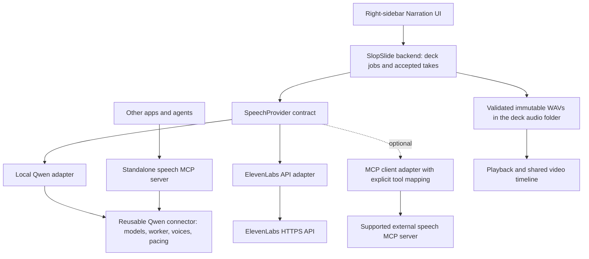

# Exchangeable speech providers

Architecture proposal — 9 October 2026. Part of the [narrated-video implementation plan](narrated-video-plan.md). **Phase 2b.1–2b.3 implemented; later adapters/MCP remain planned.** See the [implementation handoff and verification limits](implementation/narration-phase2b.md). The code now uses the standalone contract; the sections below also describe later capabilities not yet implemented. Here “speech” means text-to-speech (TTS); automatic transcription would be a separate capability.

## Decision

Introduce a versioned `SpeechProvider` interface in the backend. Extract the Qwen implementation into a reusable connector with no Tauri, deck or slide dependencies. Keep Qwen local as the default; ElevenLabs and future providers implement the same interface. The frontend presents provider capabilities and job state, rather than implementing provider behavior.

Offer the Qwen connector through a **separate, optional MCP server** for other applications and agents. MCP is a transport/tool interface over the same implementation, not a prerequisite for reuse. SlopSlide's Generate button calls its backend deterministically; it does not ask the chat agent to synthesize speech. The app uses the local connector directly. An MCP client adapter can later map a supported server into `SpeechProvider` without changing the editor or export code.

Keep the packages in this repository initially. Prove a standalone consumer before extracting a new repository or publishing a package. Avoid building a general plugin marketplace for this PoC.



## Ownership boundaries

| Layer | Owns | Does not own |
| --- | --- | --- |
| React frontend | Provider/presenter selection, scripts, capability-driven controls, setup/progress/errors and playback | Model lists, preset IDs, inference, chunking, API credentials or audio decoding |
| SlopSlide backend | Manifest revisions, deck/slide jobs, accepted-take checks, cache, artifact import, common PCM normalization and video timeline | Qwen inference internals or cloud API payload construction |
| Provider contract/adapters | Capability discovery, readiness, voices, synthesis jobs, progress/cancellation and provider error mapping | Slide HTML, deck paths, accepted-take writes or exports |
| Reusable Qwen connector | Pinned model installation/validation, resident worker, conditioning/profiles, text segmentation, synthesis and pitch-preserving Sonic pace | Tauri, React, SlopSlide manifests or deck folders |
| MCP wrapper | Protocol negotiation, tools, job/resource handles and transport | A second synthesis implementation or new voice behavior |

The speech connector returns a temporary artifact. SlopSlide validates, decodes and imports it into `<deck>/audio/<uuid>.wav`; metadata stays in `.slopslide/speech/takes/`. **Decoupling the engine does not decouple a deck from its recordings.** Model packs and private reference profiles remain shared application resources.

## Contract sketch

Define a small core interface, with optional capabilities rather than Qwen-specific commands exposed to React:

```text
describe() -> provider ID, contract version, capabilities, readiness/setup requirements
listVoices(model?, language?) -> stable provider voice IDs, labels, availability
startSynthesis(text, language, voiceRef, effectivePace, options) -> job ID
getJob(job ID) -> queued/running/succeeded/failed/cancelled, stage, progress?, result?
cancelJob(job ID) -> acknowledged + cancellation semantics
releaseArtifact(artifact ID) -> cleanup acknowledgement
optional: setup/cancelSetup/removeLocalResources
optional: create/list/deleteVoiceProfile, previewVoiceProfile
```

Capabilities describe supported languages/models, input limits, output formats, pace handling/range, local/offline operation, credentials, voice cloning and setup operations. Progress may be indeterminate; a cloud provider need not invent local inference percentages. Error categories include setup required, authentication, quota/rate limit, unsupported input, network failure, cancellation and invalid audio. The host receives actionable messages without credential values.

Requests contain speech data only, with an opaque request ID for correlation. Results contain an artifact handle, media format, actual decoded sample count/rate where available, provider/model/voice provenance and applied processing. No deck ID, arbitrary output path or accepted-take mutation enters the connector. The host independently validates duration and bounds before acceptance. Streamed previews can be added later; the first contract returns a complete artifact.

**Pace is applied once.** Each adapter chooses provider-native speed or a declared pitch-preserving processing step. Qwen retains the accepted Sonic 1.10× default; do not apply Sonic again in the host. Discover provider/model limits instead of treating the current Qwen UI range as universal. Record both the effective setting and processing version. Codec/sample-rate normalization happens once during host import, to the existing 24 kHz mono PCM16 take format; the video encoder resamples as needed.

Cancellation always prevents accepting a late result. For local Qwen it also stops the worker; for cloud providers cancellation may only stop the client request and cannot promise a refund or stopped remote computation. Do not automatically retry a billable synthesis POST after an ambiguous connection failure unless the provider supports a verified idempotency mechanism.

## Minimal frontend and presenter experience

Keep Chat/Narration in the **right sidebar**, and playback below the slide. Add a compact **Speech provider** selector above **Presenter**. Display **Local Qwen · On device** or **ElevenLabs · Cloud**, using labels/status supplied by the backend. Changing providers requires choosing a compatible presenter; retain previous accepted recordings until replacement succeeds.

**Speech settings** shows the selected provider's setup: local pack download/import for Qwen, account/credentials for ElevenLabs. The backend supplies pack sizes, readiness and supported voices. Remove the hardcoded `STOCK_VOICES`, Qwen model facts and platform assumptions from React. Keep provider-specific advanced options in backend-validated capability descriptors; do not build an unrestricted dynamic form system for this PoC.

**Add my voice…** appears only when the selected provider supports it. Qwen saves a private local profile once. A cloud provider's profile flow explains what recording/text is uploaded and follows its account/verification requirements. “Saved presenter” remains the shared UX, but cloning formats and permissions are provider-specific. A Qwen profile is not automatically transferable to ElevenLabs; never upload an existing local reference when switching providers without the user's explicit choice.

The existing mockup illustrates placement and the local flow. It does not yet show the provider selector or cloud setup; these requirements supersede its provider-specific controls.

## Provider identity, cache and migration

Introduce a versioned manifest migration with an explicit `speechProviderId` and provider-namespaced voice binding behind the existing presenter ID. A local presenter registry entry records provider, model compatibility, provider voice/profile ID and revision. Credentials belong in OS credential storage, not the manifest, frontend state, cached take metadata or logs.

Map existing version-1 `preset:*` choices to `qwen-local` without changing their selected voice, pace, accepted take IDs or WAVs. Migrate legacy source/cache metadata explicitly so unchanged Qwen narration remains reusable. Old audio stays playable/exportable even if its provider, model or profile is unavailable. Writes remain atomic and revision checked; update agent narration tools/schema guidance together with the migration. Unknown versions must not be silently rewritten.

Cache identity includes text, language, provider ID, adapter/engine revision, model ID/revision when available, provider voice/profile revision, seed/options, pace processing and normalization policy. Cloud providers may not expose immutable model revisions: retain the best available provenance and the exact accepted audio rather than promising bitwise regeneration. Never reuse a take across providers merely because its text/presenter display name matches.

## Separate MCP server

Package an optional `speech-mcp` executable using the same Qwen connector. Initial tools can mirror `describe`, `listVoices`, `startSynthesis`, `getJob` and `cancelJob`; cloning/setup tools follow capabilities. Use explicit job polling as the portable baseline. Pin and negotiate an MCP revision; optional task extensions require actual client compatibility tests.

The current `SLOPSPEECH` helper protocol **is not MCP**. The wrapper translates its private frames, routes logs to stderr and emits clean JSON-RPC on stdout, as required by [MCP stdio](https://modelcontextprotocol.io/specification/2025-06-18/basic/transports). No localhost HTTP server is needed for the first local wrapper.

Return artifact IDs/resource links and bounded metadata instead of passing full narration audio into the chat context. Specify size limits, retention and cleanup. Local consumers may resolve a trusted private spool artifact; remote consumers must fetch a readable MCP resource or approved download link and cannot assume server-local paths exist on their machine. Validate/copy results before accepting a take; clients cannot request writes to arbitrary filesystem paths. Test binary resource interoperability with the actual client rather than assuming every client previews audio.

A third-party MCP server does not automatically implement our speech contract. Its adapter must map tools, authentication, capabilities, errors and artifacts explicitly. ElevenLabs' [hosted MCP documentation](https://elevenlabs.io/docs/eleven-agents/operate/hosted-mcp) currently includes TTS with short-lived download links; its [older local server](https://github.com/elevenlabs/elevenlabs-mcp) is deprecated/archived. Prefer the documented [speech HTTP API](https://elevenlabs.io/docs/api-reference/text-to-speech/convert) for the first SlopSlide cloud adapter. Treat hosted MCP as an additional transport option after verifying its TTS controls and artifact lifetime against this contract.

For a Store build, the local connector remains a bundled, signed helper with pinned model data. The optional standalone MCP package can be distributed independently. Store functionality must not rely on downloading executable connectors or on an externally installed MCP host. Third-party executable connectors need a separate distribution/sandbox review; API connectivity itself does not establish Store eligibility.

## Implementation order and acceptance

| Step | Scope | Exit evidence |
| --- | --- | --- |
| **2b.1 — Contract and migration (implemented)** | Backend interface/DTOs, capabilities, provider identity, schema/cache migration and fixture provider | Legacy deck/takes remain usable; alternate provider can satisfy the contract without Qwen IDs. |
| **2b.2 — Extract Qwen connector (implemented)** | Move model/worker/segmentation/Sonic responsibilities behind the contract; standalone CLI consumer with caller-supplied private storage | Existing English/German output and pace remain accepted; warm reuse, cancellation and model integrity pass; consumer works without Tauri or a deck. |
| **2b.3 — Thin UI and interchange proof (implemented; native playback/reuse passed)** | Provider discovery, generic presenter/setup/job state, backend artifact normalization | Switch Qwen ↔ fixture provider through the same UI; no provider-specific frontend branch is required for voice selection or generation. Native Qwen generate/play/reopen/reuse still works. |
| **2b.4 — ElevenLabs adapter** | Official API, OS credential storage, explicit cloud/cost/data indication, decoding/import and mapped errors | Mock HTTP tests pass first. One-slide live test only with supplied credentials and explicit authorization for a potentially paid call; do not advertise support before it passes. |
| **2c — Reusable MCP package** | Wrapper, documented tools/resources, binary artifact transfer and standalone client example | Real MCP client completes discovery → synthesize → retrieve audio → cancel/cleanup without SlopSlide. External MCP adapter is separate follow-up work. |

**2b.1–2b.3 are implemented and checked; native playback/restart/legacy reuse acceptance also passed after macOS folder access was approved. Phase 3 video integration is implemented; next feature: Phase 4 saved presenters.** This is the pragmatic minimum to prevent export/UI from depending on Qwen internals. Steps 2b.4 and 2c can follow the local end-to-end video PoC; neither requires a frontend redesign. The remaining cloud/MCP steps are new work, not retroactively completed Phase 2 tasks. Reuse the existing worker and behavior; avoid changing inference quality while extracting it.

Planned test cases:

1. Load/migrate a real version-1 deck: same voice, pace, take IDs and WAV checksums; unchanged Qwen take is reused. Provider removal still allows playback/export, but new synthesis reports setup required.
2. Fixture provider returns a different codec/sample rate: backend decodes/normalizes it, derives real duration and stores the WAV in the deck. Reject malformed/empty/oversized audio and inaccessible/expired resources without changing the accepted take.
3. Edit text, switch provider, cancel or close during generation: late callbacks never overwrite the accepted take; cloud cancellation accurately reports its limits. Renaming a presenter preserves recordings; changing its profile revision invalidates reuse.
4. ElevenLabs mock responses cover authentication, quota, rate limits, network ambiguity and unsupported options. No credential appears in frontend DTOs, decks or logs; no implicit cloud fallback or duplicate billable retry occurs.
5. Standalone Qwen and MCP clients cover warm reuse, crash/cancel recovery, model hashes, clean protocol stdout, bounded resource reads and cleanup. Compare a short English/German regression sample and processed duration/pitch against retained Phase 2 evidence.
6. Native UI covers provider discovery, incompatible/missing presenter, capability-dependent cloning/setup and persistent right-sidebar drafts/playback. Run `./check.sh`; heavy model/live API checks remain explicit opt-in smoke tests.

Remaining qualification is unchanged: clean-machine downloads, baseline hardware, broader voices/long scripts, integrated sandbox/signing, licensing and full-product Store review. Provider interchange adds architecture flexibility, not new evidence that these checks passed.

The implemented v1 interface uses cancellable Rust tasks and completed PCM16 WAV artifacts; SlopSlide supplies job IDs. The polling/voice-profile/cloud-error/MCP-resource portions above are subsequent milestones. Current host normalization supports downmixing and upsampling from ≤24 kHz; unsupported formats fail explicitly until a cloud adapter qualifies its decoder/resampler.
